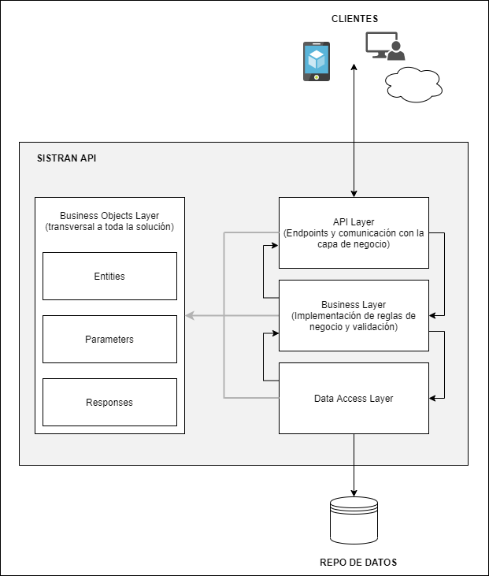
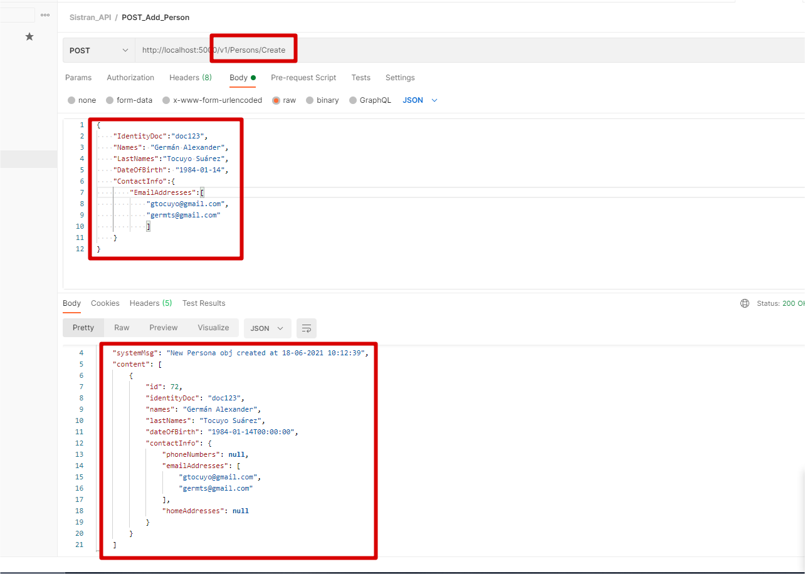
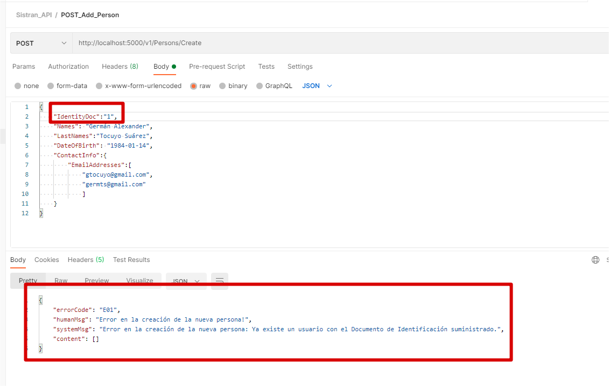
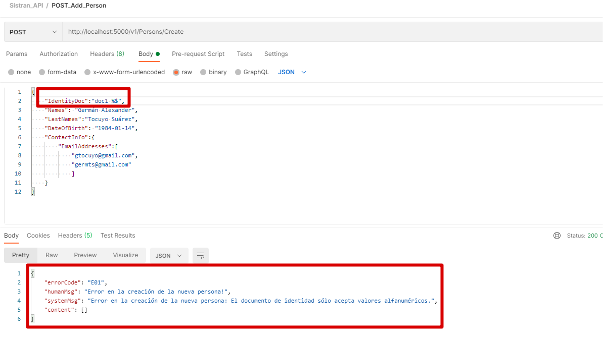

# Sistran Challenge

# Highlights

En este repo podrán encontrar el approach elegido para desarrollar para el planteamiento del challenge Sistran (pto. #14). Específicamente se trata de una API REST .NET Core 3.1 con una estructura tradicional N-Layer cuyos detalles se explican mejor en la siguiente imagen:

**A continuación la respuesta (vía Postman) de la respuesta correcta del servicio:**

**Por último un par de ejemplos de respuestas de error (aplicando las validaciones requeridas) se visualizan a continuación:**

# Disclaimers

- Para efectos de este ejercicio, se simuló la respuesta de un servicio de BD para las acciones de buscar personas existentes y crear un nuevo obj persona (ver código en DataAccess Layer).

- Para todas las respuestas, sean correctas o no (o generen error), se devuelve siempre un objeto congruente "Response" (Ver capa BusinessObjects --> Responses) con el que el cliente, cualquiera que sea, puede operar consistentemente según corresponda a su implementación.

- Ejemplo body para respuesta exitosa:

  {
    "IdentityDoc":"doc123",
    "Names": "Germán Alexander",
    "LastNames":"Tocuyo Suárez",
    "DateOfBirth": "1984-01-14",
    "ContactInfo":{
        "EmailAddresses":[
            "correo1@gmail.com",
            "correo2@gmail.com"
            ]
    }
}

- Para recibir una respuesta fallida por validación de no tener repetidos números de identificación en el Body del request el parámetro "IdentityDoc" debe ir en "1". 
